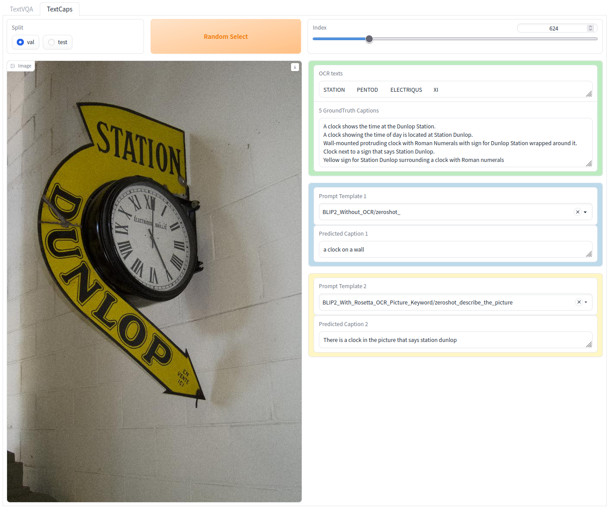

# TextVL Evaluation Result Visuliazation Demo

This is just a simple visualization application for [textvqa](https://textvqa.org/) and [textcaps](https://textvqa.org/textcaps/) evaluation result built by [gradio](https://gradio.app/). Maybe really useful for debugging evaluation error causes.

Features:

- TextVQA: OCR input, image input, question input, and answer prediction and answer groundtruth output
- TextCaps: OCR input, image input, caption prediction and caption groundtruth output
- Random select with index binding
- Select with index slider
- Select split and different ocr prompt subfolder
- two or three different prompt contrast

Usage:

```shell
pip install gradio
python visualize_gradio_app.py
```



